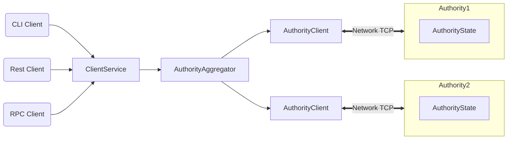

# Welcome to Bfc

Bfc is a next-generation smart contract platform with high throughput, low latency, and an asset-oriented programming model powered by the [Move programming language](https://github.com/MystenLabs/awesome-move).

## Bfc Highlights

Bfc offers the following benefits and capabilities:

 * Unmatched scalability, instant settlement
 * A safe smart contract language accessible to mainstream developers
 * Ability to define rich and composable on-chain assets
 * Better user experience for web3 apps

Bfc is the only blockchain today that can scale with the growth of web3 while achieving industry-leading performance, cost, programmability, and usability. As Bfc approaches Mainnet launch, it will demonstrate capacity beyond the transaction processing capabilities of established systems – traditional and blockchain alike. Bfc is the first internet-scale programmable blockchain platform, a foundational layer for web3.

## Bfc Architecture

## Bfc Overview

Bfc is a smart contract platform maintained by a permissionless set of authorities that play a role similar to validators or miners in other blockchain systems.

Bfc offers scalability and unprecedented low-latency for common use cases. Bfc makes the vast majority of transactions processable in parallel, which makes better use of processing resources, and offers the option to increase throughput with more resources. Bfc forgoes consensus to instead use simpler and lower-latency primitives for common use cases, such as payment transactions and asset transfers. This is unprecedented in the blockchain world and enables a number of new latency-sensitive distributed applications, ranging from gaming to retail payment at physical points of sale.

Bfc is written in [Rust](https://www.rust-lang.org) and supports smart contracts written in the [Move programming language](https://github.com/move-language/move) to define assets that may have an owner. Move programs define operations on these assets including custom rules for their creation, the transfer of these assets to new owners, and operations that mutate assets.

Bfc has a native token called SUI, with a fixed supply. The SUI token is used to pay for gas, and is also used as [delegated stake on authorities](https://learn.bybit.com/blockchain/delegated-proof-of-stake-dpos/) within an epoch. The voting power of authorities within this epoch is a function of this delegated stake. Authorities are periodically reconfigured according to the stake delegated to them. In any epoch, the set of authorities is [Byzantine fault tolerant](https://pmg.csail.mit.edu/papers/osdi99.pdf). At the end of the epoch, fees collected through all transactions processed are distributed to authorities according to their contribution to the operation of the system. Authorities can in turn share some of the fees as rewards to users that delegated stakes to them.

Bfc is backed by a number of state-of-the-art [peer-reviewed works](https://github.com/MystenLabs/sui/blob/main/docs/content/references/research-papers.mdx) and years of open source development.

## More About Bfc

Use the following links to learn more about Bfc and the Bfc ecosystem:

 * Learn more about working with Bfc in the [Bfc Documentation](https://docs.sui.io/).
 * Join the Bfc community on [Bfc Discord](https://discord.gg/sui).
 * Find out more about the Bfc ecosystem on the [Bfc Resources](https://sui.io/resources/) page.
 * Review information about Bfc governance, [decentralization](https://suifoundation.org/decentralization), and [Developer Grants Program](https://sui.io/grants-hub) on the [Bfc Foundation](https://suifoundation.org/) site.
